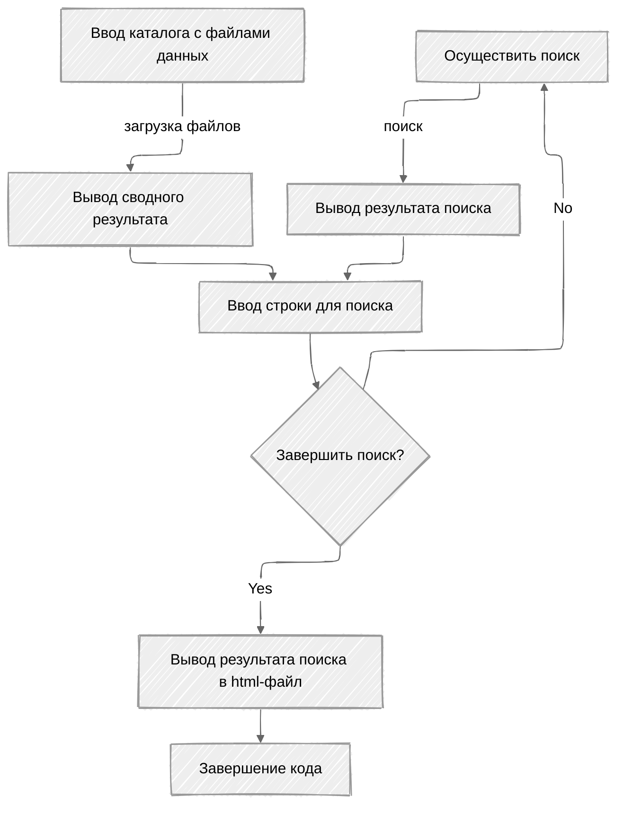

# Анализатор прайс-листов

Данный проект помогает анализировать массив прайс-листов в формате csv. Прайс листы могут содержать различные поля, как по количеству, так и по названию. Алгоритм сам выделяет нужные поля, удаляет ненужные. Управление "нужными" полями осужествяется через словарь **`WORD_DICT`**.  

Решение реализовано в 2 вариантах:
**project.py** - решение через библиотеку **csv**, в конце выводит HTML-файл **output.html**
**project_pandas.py** - решение через библиотеку _**pandas**_, в конце выводит HTML-файл **output_pd.html**
Оба варианта осуществляют поиск без учета регистра. Для названия полей введен словарь **`WORD_DICT`**.  

Также есть возможность использования данного модуля в качестве библиотеки внутри других решений.  

В модуле project_pandas.py цикл поиска нужных столбцов заменен на более универсальный. Так можно управлять полями через **`WORD_DICT`** не переписывая логику метода **load_prices()**.

```python
for k, v in WORD_DICT.items():
     if field in v:
         data_ = data_.rename(columns={field: k})
         break
else:
    data_ = data_.drop(field, axis=1)
```
Вывод на консоль осуществляется в формате таблицы:
```
-------------------------------------------------------------------------------------------------------
|  №   |                 Название                 |    Цена    |  Вес  |      Файл       | Цена за кг.|
-------------------------------------------------------------------------------------------------------
|    1 | Филе гигантского кальмара                |     617.00 |     1 | price_0.csv     |     617.00 |
|    2 | Филе гигантского кальмара                |     639.00 |     1 | price_4.csv     |     639.00 |
|    3 | Филе гигантского кальмара                |     639.00 |     1 | price_6.csv     |     639.00 |
|    4 | Филе гигантского кальмара                |     683.00 |     1 | price_1.csv     |     683.00 |
|    5 | Филе гигантского кальмара                |    1381.00 |     2 | price_5.csv     |     690.50 |
|    6 | Кальмар тушка                            |    3420.00 |     3 | price_3.csv     |    1140.00 |
|    7 | Кальмар тушка                            |    4756.00 |     4 | price_0.csv     |    1189.00 |
-------------------------------------------------------------------------------------------------------
```
Схематичное изображение алгоритма работы кода:


### Скриншот консольного вывода: 


### Скриншот html-вывода:


### Ниже приведен текст технического задания:

```
Написать анализатор прайс-листов.
В папке находятся несколько файлов, содержащих прайс-листы от разных поставщиков.
Количество и название файлов заранее неизвестно, однако точно известно, что в названии
файлов прайс-листов есть слово "price". Файлы, не содержащие слово "price" следует игнорировать.
Формат файлов: данные, разделенные точкой с запятой.
Порядок колонок в файле заранее неизвестен, но известно, что столбец с названием товара называется
одним из вариантов: "название", "продукт", "товар", "наименование".
Столбец с ценой может называться "цена" или "розница".
Столбец с весом имеет название "фасовка", "масса" или "вес" и всегда указывается в килограммах.
Остальные столбцы игнорировать.

Программа должна загрузить данные из всех прайс-листов и предоставить интерфейс для поиска товара
по фрагменту названия с сорторовкой по цене за килогорамм.
Интерфейс для поиска реализовать через консоль, циклически получая информацию от пользователя.
Если введено слово "exit", то цикл обмена с пользователем завершается, программа выводит сообщение
о том, что работа закончена и завершает свою работу. В противном случае введенный текст считается
текстом для поиска. Программа должна вывести список найденных позиций в виде таблицы:

№     Наименование                              цена  вес     файл     цена за кг.
1     филе гигантского кальмара                  617    1  price_0.csv  617.0
2     филе гигантского кальмара                  639    1  price_4.csv  639.0
3     филе гигантского кальмара                  639    1  price_6.csv  639.0
4     филе гигантского кальмара                  683    1  price_1.csv  683.0
5     филе гигантского кальмара                 1381    2  price_5.csv  690.5
6     кальмар тушка                             3420    3  price_3.csv  1140.0
7     кальмар тушка                             4756    4  price_0.csv  1189.0

Список должен быть отсортирован по возрастанию стоимости за килограмм.

Предусмотреть вывод массива данных в текстовый файл в формате html.
Создать класс с методами:
load_prices - сканирует папку и загружает данные
export_to_html - выгружает все данные в html файл
find_text - получает текст и возвращает список позиций, содержащий этот текст в названии продукта.
```
